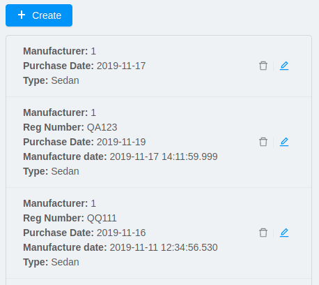

# CUBA Platform Frontend Tools and Libraries

[](https://travis-ci.org/cuba-platform/frontend)
[](http://commitizen.github.io/cz-cli/)

# Frontend UI

Frontend UI is an alternative to the [Generic UI](https://doc.cuba-platform.com/manual-latest/gui_framework.html) that provides frontend-oriented development experience, more flexibility in terms of layout customization and easy integration of UI libraries and components from vast JavaScript ecosystem.

## Documentation

Actual [documentation](https://doc.cuba-platform.com/frontend) is available on the website.

## Old Documentation

The documentation below is actual for previously released versions:

| Package                        | Version |
| ------------------------------ | --------|
| @cuba-platform/front-generator | 2.4.x   |
| @cuba-platform/rest            | 0.7.x   |
| @cuba-platform/react           | 0.4.x   |

### Table of Contents

[comment]: <> (Run `npm run doc:toc` to update the table of contents. Do not alter comments around it.)
[comment]: <> (TOC-start)
- [Overview](#overview)
- [Getting Started](#getting-started)
    - [Getting Started Using CUBA Studio](#getting-started-studio)
    - [Getting Started Using CLI](#getting-started-cli)
- [Generator CLI](#generator)
    - [Commands Description](#generator-commands-description)
- [React Client](#react-client)
    - [Overview of React Client](#react-client-overview)
    - [Creating React Components](#react-client-creating-components)
    - [Observable State with MobX](#react-client-mobx)
    - [CUBA React Components](#react-client-cuba-react)
    - [Routing and Menu](#react-client-routing)
    - [Forms](#react-client-forms)
    - [I18n](#react-client-i18n)
    - [Customizing Theme](#react-client-theme)
    - [Backend Model](#react-client-backend-model)
    - [Synchronizing Project Model](#react-client-sync)
    - [Security](#react-client-security)
    - [Building the Client](#react-client-build)
    - [Configuration](#react-client-configuration)
- [Polymer-based Client (Deprecated)](#polymer-client)
- [TypeScript SDK](#typescript-sdk)
    - [Entities](#react-client-entities)
    - [Enums](#react-client-enums)
- [REST API](#rest-api)

[comment]: <> (TOC-end)

<a name="overview"/>

## Overview

This tool can be used to generate:
- a front-end client for a CUBA Platform based application. The client can be powered by one of the following frameworks:
  - React
  - Polymer
- a framework-agnostic [TypeScript SDK](#typescript-sdk)

> NOTE: Polymer client is deprecated and is not supported anymore

The front-end client is an alternative to the [Generic UI](https://doc.cuba-platform.com/manual-latest/gui_framework.html)
providing front-end oriented development experience. 
It's more flexible in terms of layout customization and allows easy integration of
UI libraries and components from vast JavaScript ecosystem. 
However, it requires better knowledge of modern front-end stack.

The generator is used by [CUBA Studio](https://doc.cuba-platform.com/studio/) for [front module](https://doc.cuba-platform.com/manual-latest/front_ui.html) creation.
Alternatively it can be used as a standalone CLI tool.

##### Supported Browsers

The client supports all modern (evergreen) browsers. 
In order to support IE 9,10,11 [additional configuration](https://facebook.github.io/create-react-app/docs/supported-browsers-features) 
required.

<a name="getting-started"/>

## Getting Started

We recommend using an IDE with [TypeScript](http://www.typescriptlang.org/) support: [VSCode](https://code.visualstudio.com/),
WebStorm or [IntelliJ IDEA](https://www.jetbrains.com/idea/) Ultimate Edition.

Steps will vary depending on whether you are using the generator from CUBA Studio or as a standalone CLI tool. 

<a name="getting-started-studio"/>

### Getting Started Using CUBA Studio

#### Installation

Install [CUBA Studio](https://doc.cuba-platform.com/studio/#installation).

#### Generating a Client from Studio

You can generate a client as [a module of CUBA application](https://doc.cuba-platform.com/studio/#modules). 
You will be able to create CRUD screens using CUBA Studio UI.

<a name="getting-started-cli"/>

### Getting Started Using CLI

#### Installation

Install [Node.js](https://nodejs.org/en/download/) 10.15+ and npm 6+ (usually comes with node).

Install the generator using npm package manager: 

```bash
npm install -g @cuba-platform/front-generator
```

Use the generator by running the following command in command line:

```bash
gen-cuba-front
```

Alternatively, you can run the generator without installation using [npx](https://www.npmjs.com/package/npx):

```bash
npx @cuba-platform/front-generator
```

#### Generating a Client Using CLI

In order to generate a starter app, we need to feed the generator with project metadata (what entities do we have, etc.). 
There are two ways of doing that.

##### Passing Project Metadata from CUBA Studio

- Open your project in CUBA Studio. 
- Open settings (`File > Settings`), then open `Languages & Frameworks > CUBA`. 
- Tick the `Old Studio integration` checkbox:
                                  


Now generator will be able to automatically detect CUBA projects opened in Studio.

Generate a starter React app by running the following command:

```bash
gen-cuba-front react-typescript:app
```

Generator will prompt you to select one of the currently opened CUBA projects.


##### Passing Project Metadata Manually

You can export the project model manually. Select `CUBA > Advanced > Export project model` in the main menu. Studio will generate `projectModel.json` file.

Use `--model` command line option to specify location of the project model file:

```bash
gen-cuba-front react-typescript:app --model /work/cuba-samples/sample-sales/projectModel.json
```

<a name="generator"/>

## Generator CLI

Run `gen-cuba-front` (or `npx @cuba-platform/front-generator`) without arguments to see usage info.

```
Usage: gen-cuba-front [command] [options]

  Options:

    -v, --version  output the version number
    -h, --help     output usage information

  Commands:

    list [options]                                   List all available clients and their clients
    polymer2:app [options]                           Generates polymer2 app
    polymer2:blank-component [options]               Generates polymer2 blank-component
    polymer2:entity-cards [options]                  Generates polymer2 entity-cards
    polymer2:entity-edit [options]                   Generates polymer2 entity-edit
    polymer2:entity-list [options]                   Generates polymer2 entity-list
    polymer2:entity-management [options]             Generates polymer2 entity-management
    polymer2:query-results [options]                 Generates polymer2 query-results
    polymer2:service-data [options]                  Generates polymer2 service-data
    polymer2:service-form [options]                  Generates polymer2 service-form
    polymer2-typescript:app [options]                Generates polymer2-typescript app
    polymer2-typescript:blank-component [options]    Generates polymer2-typescript blank-component
    polymer2-typescript:entity-cards [options]       Generates polymer2-typescript entity-cards
    polymer2-typescript:entity-edit [options]        Generates polymer2-typescript entity-edit
    polymer2-typescript:entity-list [options]        Generates polymer2-typescript entity-list
    polymer2-typescript:entity-management [options]  Generates polymer2-typescript entity-management
    react-typescript:app [options]                   Generates react-typescript app
    react-typescript:blank-component [options]       Generates react-typescript blank-component
    react-typescript:entity-cards [options]          Generates react-typescript entity-cards
    react-typescript:entity-management [options]     Generates react-typescript entity-management
    sdk:all [options]                                Generates sdk all
    sdk:model [options]                              Generates sdk model
```

> NOTE: Polymer client is deprecated

Run `gen-cuba-front <command> --help` to see the list of available options.

Most commands use interactive prompts to capture necessary inputs such as which entity you want to use,
which [view](https://doc.cuba-platform.com/manual-latest/views.html), etc.
Alternatively, `answers` command line parameter can be used to provide these inputs. You may want to use it if you want to automate the generation. `answers` is a base64-encoded JSON string. See [descriptions of individual commands](#generator-commands-description) for details on what shall be put inside this JSON.   

Example of using `answers`:

```
gen-cuba-front react-typescript:entity-management \
  --dest ../model-playground/modules/front/src/app/car \
  --model /home/myusername/model-playground/projectModel.json \
  --dirShift ../../ \
  --answers eyJlZGl0VmlldyI6eyJuYW1lIjoiY2FyLXZpZXciLCJlbnRpdHlOYW1lIjoibXBnJENhciJ9LCJlZGl0Q29tcG9uZW50TmFtZSI6Im1wZy1jYXItZWRpdCIsImxpc3RWaWV3Ijp7Im5hbWUiOiJjYXItdmlldyIsImVudGl0eU5hbWUiOiJtcGckQ2FyIn0sImxpc3RDb21wb25lbnROYW1lIjoibXBnLWNhci1saXN0IiwibGlzdFR5cGUiOiJsaXN0IiwiZW50aXR5Ijp7Im5hbWUiOiJtcGckQ2FyIn0sIm1hbmFnZW1lbnRDb21wb25lbnROYW1lIjoibXBnLWNhci1tYW5hZ2VtZW50In0=
```

<a name="generator-commands-description"/>

### Commands Description

##### react-typescript:app

Generates a React starter app. See [Getting started](#getting-started).

```
  Options:

    -d, --dest [dest]    destination directory
    -m, --model [model]  specify path to project model, if given no interactive prompt will be invoked
    -h, --help           output usage information
```

<a name="react-typescript-entity-management"/>

##### react-typescript:entity-management

Generates:
- Route / main menu item
- Editor screen to create or edit an entity
- Browser screen to view the list of entities and/or perform CRUD operations.

```
  Options:

    -d, --dest [dest]           destination directory
    -m, --model [model]         specify path to project model, if given no interactive prompt will be invoked
    -ds, --dirShift [dirShift]  directory shift for html imports e.g ../../
    -a, --answers [answers]     fulfilled params for generator to avoid interactive input in serialized JSON string
    -h, --help                  output usage information
```

Browser screen is available in one of the following flavors (we call it list types):
- list



- cards


- table


`answers` format:

```
{
    "editView": {
      "name": "car-edit", // Name of view that will be used in Editor screen
      "entityName": "mpg$Car" // Entity name
    },
    "editComponentName": "CarEdit", // Editor component class name 
    "listView": {
      "name": "car-edit", // Name of view that will be used in Browser screen
      "entityName": "mpg$Car" // Entity name
    },
    "listComponentName": "CarCards", // Browser component class name
    "listType": "cards", // List type: list, cards or table
    "entity": {
      "name": "mpg$Car" // Entity name
    },
    "managementComponentName": "CarManagement" // Management component class name (renders either Editor or Browser depending on current route) 
    }
}
```   

##### react-typescript:entity-cards

Generates a list of entities where each entity is represented by a card
(similar to a Browser component with `"listType": "cards"`, see [react-typescript:entity-management](#react-typescript-entity-management))

```
  Options:

    -d, --dest [dest]           destination directory
    -m, --model [model]         specify path to project model, if given no interactive prompt will be invoked
    -ds, --dirShift [dirShift]  directory shift for html imports e.g ../../
    -a, --answers [answers]     fulfilled params for generator to avoid interactive input in serialized JSON string
    -h, --help                  output usage information

```

`answers` format:

```
{
    "entityView": {
      "name": "favoriteCar-view", // View name
      "entityName": "mpg$FavoriteCar" // Entity name 
    },
    "componentName": "FavoriteCarCards", // Component class name
    "entity": {
      "name": "mpg$FavoriteCar" // Entity name 
    }
}
```

##### react-typescript:blank-component

Generates a blank component.

```
  Options:

    -d, --dest [dest]           destination directory
    -m, --model [model]         specify path to project model, if given no interactive prompt will be invoked
    -ds, --dirShift [dirShift]  directory shift for html imports e.g ../../
    -a, --answers [answers]     fulfilled params for generator to avoid interactive input in serialized JSON string
    -h, --help                  output usage information

```

`answers` format:

```
{
    "componentName": "BlankComponent" // Component class name
}
```

##### sdk:all

Generates framework-agnostic [TypeScript SDK](#typescript-sdk).
It is also generated when executing `react-typescript:app` command.

```
  Options:

    -d, --dest [dest]    destination directory
    -m, --model [model]  specify path to project model, if given no interactive prompt will be invoked
    -h, --help           output usage information
```

##### sdk:model

Generates SDK model only.

```
  Options:

    -d, --dest [dest]    destination directory
    -m, --model [model]  specify path to project model, if given no interactive prompt will be invoked
    -h, --help           output usage information
```

<a name="react-client"/>

## React Client

<a name="react-client-overview"/>

### Overview of React Client

#### Running the Client

You can run the client by executing the following command:

```bash
npm run start
```

This will launch a dev server and allow you to access your app at `localhost:3000`.

If the client was generated via CUBA Studio (as a module of CUBA application) you can use Gradle in order
to run npm tooling:

```bash
./gradlew npm_run_start
``` 
> There is a known [bug](https://github.com/srs/gradle-node-plugin/issues/339) in Gradle node plugin which does not
> kill JS development server on task interruption. 

You can also run your CUBA application normally (e.g. via `CUBA -> Start Application Server`) and front-end client will
be accessible at `localhost:8080/app-front` (context root can be [configured](react-client-configuration)). However, in this case hot deploy will not be available.
We recommend using one of the above methods during development.    

#### Technologies

The client is based on the following frameworks and libraries: 

* [React](https://reactjs.org/) - UI rendering;
* [MobX](https://mobx.js.org/) - reactive state management;
* [Ant Design](https://ant.design/docs/react/introduce) - UI components;
* [React Router](https://reacttraining.com/react-router/) - routing;
* [CUBA React](packages/cuba-react) - CUBA React components and utilities;
* [CUBA REST JS](packages/cuba-rest-js) - interaction with СUBA generic REST API;
* [Create React App](https://facebook.github.io/create-react-app/) - build scripts and configuration;

#### Project Structure

Here is the structure of the newly generated project:

```
app-name/
  package.json
  package-lock.json
  node_modules/
  public/
    index.html
    favicon.ico
  src/
    index.css
    index.tsx          <- App entry point. Do not move/rename this file
    routing.ts         <- Routing configuration
    app/
      App.css
      App.tsx          <- App shell. Switches between Login form and internal application
    cuba/              <- CUBA Model. See [Backend model]
      entitites/       <- Project entities
        base/          <- Entities from addons and framework
      enums/           <- Project enums
```

If the client was generated using Studio it's placed in `modules/front` directory of main project. 

<a name="react-client-creating-components"/>

### Creating React Components

It is highly recommended to read full [React documentation](https://reactjs.org/docs/getting-started.html).
In React, like in many modern frameworks everything is a component. 
We use components to create reusable blocks of our application as well as particular pages and screens. 

Let's create our first component: place file `Button.tsx` in `src` directory: 

```typescript jsx
import React, { Component } from 'react';

export class Button extends Component {
  render() {
    <button>Click me</button>;
  }
}
```

Alternatively, you can create the component using a function:

```typescript jsx
export function Button(props) {
  return <button>{props.name}</button>;
}
```

<a name="react-client-mobx"/>

### Observable State with MobX

[MobX](https://mobx.js.org/intro/overview.html) is a library for reactive state management which enables to work with 
state in a convenient and concise way. 

Consider the following example:

```typescript jsx
@observer 
class Counter extends React.Component {

  @observable
  count = 0;
  
  render() {
    return (
      <div>
        Counter: {this.count} <br />
        <button onClick={this.handleInc}> + </button>
        <button onClick={this.handleDec}> - </button>
      </div>
    )
  }

  handleInc = () => {
    this.count++;
  }

  handleDec = () => {
    this.count--;
  }
}
```

As soon as we decorate a class or a function component as [observer](https://mobx.js.org/refguide/observer-component.html), it automatically subscribes to changes on any [observable](https://mobx.js.org/refguide/observable.html) value or object i.e. in the example above changing `count` property will result in automatic re-render of the component.

<a name="react-client-cuba-react"/>

### CUBA React Components

##### MainStore

`MainStore` contains common application data. It's being initialized using `<CubaAppProvider>`:

```typescript
<CubaAppProvider cubaREST={cubaREST}>
   // App component tree
</CubaAppProvider>
```

You can inject it in any component using `@injectMainStore` decorator:

```typescript
@injectMainStore
@observer
export class AppInfo extends React.Component<MainStoreInjected> {
  render() {
    if (!this.props.mainStore) {
      return null;
    }
    const {
      initialized,
      authenticated,
      userName,
      metadata,
      messages,
      enums
    } = this.props.mainStore;
    return (
      <ul>
        <li>App initialized: {initialized ? 'yes' : 'no'}</li>
        <li>User authenticated: {authenticated ? 'yes' : 'no'}</li>
        <li>User name: {userName}</li>
        <li>Metadata: {JSON.stringify(metadata)}</li>
        <li>Messages: {JSON.stringify(messages)}</li>
        <li>Enums: {JSON.stringify(enums)}</li>
      </ul>
    )
  }
}
```
##### DataCollectionStore
`DataCollectionStore` is a MobX based store for loading entity collections. It can be created via `collection()` initializer function:
```typescript
dataCollection = collection<Pet>(Pet.NAME, {
    view: 'pet-with-owner-and-type',
    sort: 'identificationNumber',
    filter: {conditions: [{property: 'name', operator: "contains", value: 'Ro'}]},
    limit: 10,
    offset: 0,
    loadImmediately: true, // true by default
  }
);
```
Typically it's being used to display list of entities. Since it's reactive, any changes in `items` and `status` will trigger re-render of `@observer` components:
```typescript
@observer
class CarList extends React.Component {
  carsData = collection<Car>(Car.NAME, {view: 'car-view', sort: '-updateTs'});
  render() {
    if (this.carsData.status === "LOADING") return 'Loading...';
    return (
      <ul>
        {this.carsData.items.map(car =>
           <li>{car._instanceName}</li>
        )}
      </ul>
    )
  }
}
``` 

##### DataInstanceStore
`DataInstanceStore` is used to work with a single instance of some Entity. It can be created via `instance()` initializer function:
```typescript
dataInstance = instance<Pet>(Pet.NAME, {view: 'pet-with-owner-and-type', loadImmediately: false});
```
Use `dataInstance.commit()` method to perform entity update:
```typescript
dataInstance.item.name = 'New Name';
dataInstance.commit()
```

##### EntityProperty
`<EntityProperty>` component is aimed to display a value of some Entity's property. It automatically applies formatting according to the type of property and adds a corresponding label from global message pack (defined on the backend)
```typescript
<EntityProperty entityName={Pet.NAME}
                propertyName='birthDate'
                value={pet.birthDate}/>
```

##### FormField

`<FormField>` component automatically creates correct Form UI component based on entity and property names:

```typescript
<FormField entityName={Pet.NAME} propertyName='birthDate'/>
```
For the attributes with relationship it's possible to provide an instance of DataCollectionStore via `optionsContainer` prop to render options list
```typescript
petTypesDc = collection<PetType>(PetType.NAME, {view: '_minimal', sort: 'name'});
...
<FormField entityName={Pet.NAME}
           propertyName='type'
           optionsContainer={this.petTypesDc}/>
```

##### DataTable

`<DataTable>` is used to present data in tabular form.


It uses Ant Design's [Table](https://ant.design/components/table/) under the hood and provides the following additional
benefits:

- out-of-the-box integration with `DataCollectionStore`
- powerful filters   
- support for action buttons (e.g. for CRUD operations)
 
At the same time `<DataTable>` provides developer with a full access to underlying `Table` via its `tableProps` and `columnProps`
properties (see below). 

Example of using `<DataTable>`'s API:

```html
<DataTable dataCollection={this.dataCollection}
           fields={this.fields}
           onSelectedRowChange={this.onSelectedRowChange}
           buttons={buttons}
           tableProps={{
             bordered: true
           }}
           columnProps={{
             align: 'right'
           }}
/>
```

- `dataCollection` - instance of `DataCollectionStore`
- `fields` - array of entity property names
- `onSelectedRowChange` - callback that takes the id of selected row, can be used together with `buttons` e.g. to facilitate CRUD operations
- `buttons` - array of React elements representing controls that will be rendered above the table
- `tableProps` - can be used to override any of the underlying [Table properties](https://ant.design/components/table/#Table)
- `columnProps` - can be used to override any of the underlying [Column properties](https://ant.design/components/table/#Column).
It shall be used instead of redefining `columns` in `tableProps` if the goal is to extend rather that fully replace the existing
custom column-related functionality.

##### API Reference

API reference for CUBA React components can be found [here](http://cuba-platform.github.io/frontend/docs/cuba-react).

<a name="react-client-routing"/>

### Routing and Menu

Routing is based on well-known [React Router](https://reacttraining.com/react-router/web/guides/quick-start) library.
The generated app has a single point (`src/routing.ts`) to define screens which will be automatically placed
in the main menu:

```typescript jsx
menuItems.push({
  pathPattern: '/pets', // pattern may be used to consume some parameters, e.g.: /pets/:petId?
  menuLink: '/pets',
  component: PetBrowser, // component to be rendered, should be imported in `routes.ts`
  caption: 'Pets' // Menu item caption
});
```

The `src/App.tsx` contains `Switch` component which renders screen depending on the URL path: 

```typescript jsx
  <Switch>
    <Route exact={true} path="/" component={HomePage}/>
  {collectRouteItems(menuItems).map(route => (  // get all routes from main and sub menus
  <Route key={route.pathPattern} path={route.pathPattern} component={route.component}/>
    )}
  </Switch>
```

You can manually add `Route` to `Switch` component or customize the structure used in `routes.ts` for example in order to create 
hierarchical menu.

#### Sub Menus

To create hierarchical menu you need to create `SubMenu` instance  in `routes.ts` and add it to `menuItems`
```typescript jsx
// This is RouteItem object that we want to see in User Settings sub menu
const userProfileRouteItem = {
  pathPattern: "/profile",
  menuLink: "/profile",
  component: UserProfile,
  caption: "UserProfile"
};

// SubMenu 
const userSettingsSubMenu = {
  caption: 'UserSettings', // add router.UserSettings key to src/i18n/en.json for valid caption
  items: [userProfileRouteItem]};

// Add sub menu to menu config
menuItems.push(userSettingsSubMenu);
```

Sub menus can have unlimited nesting. One sub menu could be used as item of another.

<a name="react-client-forms"/>

### Forms

In order to facilitate data binding, Ant Design's [Form](https://ant.design/components/form/) component and utilities
are used in the app. 

`getFieldDecorator` is a useful higher order function which allows you to set up validation and binding. See the following example:

```typescript jsx
  <Form.Item label='name'>
     getFieldDecorator('model', {
       normalize: (value) => {
         return value === '' ? null : value; // Normalize value so that empty string is converted to null
       },
       rules: [ // Allows you to setup front-end validation rules
         {required: true} 
       ]
     })(
        <FormField entityName={Entity.NAME}
                   propertyName='model'/>
     )}
  </Form.Item>
```

<a name="react-client-i18n"/>

### I18n

i18n is powered by [react-intl](https://github.com/formatjs/react-intl) library.

Out of the box React client supports `en` and `ru` locales.

##### Adding New Localized Content

- Add new messages to `src/i18n/{locale}.json` files
- Refer to them from your code using standard `react-intl` components or API (see [documentation](https://github.com/formatjs/react-intl/blob/master/docs/README.md))
 
##### Overriding Existing Messages

Simply replace existing messages in `src/i18n/{locale}.json` files.
This way you can override messages in client app, `cuba-react` components and some of the messages in `antd` components. 

##### Adding Support for New Locales

- Add a corresponding `{locale}.json` message pack. 
Note that it shall contain messages for `cuba-react` components (keys starting with `cuba-react`)
and `antd` `Form` validation messages (keys starting with `antd.form.validation`)
- Create a mapping between locale and message pack by modifying `messagesMapping` in `src/i18n/i18nMappings.ts`
- Create a mapping between locale and `antd/es/locale-provider/Locale` object by modifying `antdLocaleMapping` in `src/i18n/i18nMappings.ts`.
> This is required because most of the messages in `antd` components are translated by telling `antd` to use one of the predefined locales.
> An extensive list of locales supported by `antd` can be found [here](https://ant.design/docs/react/i18n).
- Add import of corresponding [moment](https://github.com/moment/moment) locale to `index.tsx`, e.g. `import 'moment/locale/ru';`
> This is required because some of `antd` components use localized messages from `moment`.
- Add a means of switching to the new locale. E.g. if you are using the default `LanguageSwitcher` - add a locale option into it.

<a name="react-client-theme"/>

### Customizing Theme

Ant Design provides a possibility to [customize theme](https://ant.design/docs/react/customize-theme) using `less` and
overriding built-in variables. You can also use these variables in your own code.

In order to do so, you will need to make some modifications to the generated app.

> NOTE: you will have to enable deprecated inline Javascript in `less` as `antd` makes heavy use of it.
> [Reasons for deprecation.](http://lesscss.org/usage/#less-options-strict-units)
- Install the required dependencies. Note that we are using [react-app-rewired](https://github.com/timarney/react-app-rewired) to modify the webpack config without having to `eject`.  
```shell script
npm i react-app-rewired less less-loader customize-cra babel-plugin-import --save-dev
```
- Create `config-overrides.js` file in the app root. The file shall look like this. 
```typescript
const {addLessLoader, override, fixBabelImports} = require("customize-cra");
const path = require('path');
module.exports = override(
  fixBabelImports('import', {
      libraryName: 'antd',
      libraryDirectory: 'es',
      style: true,
  }),
  addLessLoader({
    javascriptEnabled: true,
    modifyVars: {
      'overrideTheme': `true; @import "${path.resolve(__dirname, './src/theme.less')}";`,
    },
  }),
);
```
Now you can place your overrides in `src/theme.less`:
```less
@primary-color: #1DA57A;
``` 

You can use `antd` variables in your code like this:
```less
@import "~antd/es/style/themes/default";
body {
  background: @list-header-background;
}
```

References:
 - detailed [documentation](https://ant.design/docs/react/use-with-create-react-app#Customize-Theme) on Ant Design
website

##### CSS Methodology

Both client and CUBA React follow [RSCSS methodology](http://rscss.io).
Additionally, we adopt Base Rules from [SMACSS methodology](http://smacss.com/book/type-base).

<a name="react-client-backend-model"/>

### Backend Model

`src/cuba` directory contains TypeScript representation of project's entities, views and facades to access REST services.
See more details in [TypeScript SDK](#typescript-sdk) section.
Here is the layout of the directory:

* `entities` - project entities and views;
* `entities/base` - framework and addons entities;
* `enums` - project enums;
* `services.ts` - middleware services exposed to REST;
* `queries.ts` - REST queries.

Consider the `Role` entity class of CUBA Framework generated in typescript:

`src/cuba/entities/base/sec$Role.ts`
```typescript
export class Role extends StandardEntity {
    static NAME = "sec$Role";
    name?: string | null;
    locName?: string | null;
    description?: string | null;
    type?: any | null;
    defaultRole?: boolean | null;
    permissions?: Permission[] | null;
}
```

* You can easily access entity name by static `NAME` property: `Role.NAME`,
* The class contains all properties of the domain model entity including ones from class hierarchy.
Reference fields have corresponding types as well so that you can work with them in a type-safe manner:  

```typescript
function changeRole(role: Role) {
  role.defaultRole = true;   // ok
  role.defaultRole = 'foo';  // compilation fails  
}
```

<a name="react-client-sync"/>

### Synchronizing Project Model

In order to regenerate project model to conform changes in the backend you can use the following command:
 
```bash
$ npm run `update-model`
```

<a name="react-client-security"/>

### Security

Since React client works via Generic REST API endpoints, the backend (CUBA) application should have properly configured Security 
Roles and Access groups. See the [corresponding chapter](https://doc.cuba-platform.com/restapi-7.1/#security) in REST API documentation.

<a name="react-client-build"/>

### Building the Client

`$ npm run build` command builds your app for production use. See `build` folder.

See [available scripts](https://facebook.github.io/create-react-app/docs/available-scripts) in Create React App documentation.

<a name="react-client-configuration"/>

### Configuration

By default, client deployed to Tomcat is built with production preset and aimed to be served under 
`app-front` context. Use `PUBLIC_URL` env variable to change this behavior (see `.env.production.local`).

The client served from development server has absolute URL of REST API specified in `REACT_APP_CUBA_URL` 
(see `.env.development.local`).

See the [list of all available environment variables](https://facebook.github.io/create-react-app/docs/advanced-configuration).

See `src/config.ts` for full list of common application settings used in runtime.

<a name="polymer-client"/>

## Polymer-based Client (Deprecated)

Documentation can be found [here](https://doc.cuba-platform.com/manual-latest/polymer_ui.html).

<a name="typescript-sdk"/>

## TypeScript SDK

TypeScript SDK contains CUBA data model
([entities and enums](https://doc.cuba-platform.com/manual-latest/data_model.html)), 
rest [services](https://doc.cuba-platform.com/restapi-7.1/#rest_api_v2_services_config) 
and [queries](https://doc.cuba-platform.com/restapi-7.1/#rest_api_v2_queries_config) 
as TypeScript classes.

The SDK is framework-agnostic, meaning that in addition to using it with our React client, you can use it with any
TypeScript-compatible framework such as Angular of Vue.  

It's possible to generate the following configurations of SDK depending on your needs (see [usage instruction](#getting-started-cli)):

- ```gen-cuba-front sdk:model``` - generates entities and enums<br>
- ```gen-cuba-front sdk:all``` - generates all toolkit - entities, enums, queries and services<br>

SDK can be used for front-end clients and Node.js-based BFF (Backend for Frontend) development.

<a name="react-client-entities"/>

### Entities

##### Persistent Entities

Consider the `Role` entity class of CUBA Framework generated in TypeScript:

`src/cuba/entities/base/sec$Role.ts`
```typescript
export class Role extends StandardEntity {
    static NAME = "sec$Role";
    name?: string | null;
    locName?: string | null;
    description?: string | null;
    type?: any | null;
    defaultRole?: boolean | null;
    permissions?: Permission[] | null;
}
```

* you can easily access entity name by static `NAME` property: `Role.NAME`,
* class contains all properties of domain model entity including from class hierarchy,
reference fields have corresponding types as well so that you can work with them in a type-safe manner:  

```typescript
function changeRole(role: Role) {
  role.defaultRole = true;   // ok
  role.defaultRole = 'foo';  // compilation fails  
}
```

##### Non-persistent Entities
CUBA Platform supports non-persistent entities in model.  Entity class should be annotated with ```com.haulmont.chile.core.annotations.MetaClass```, 
and extended from ```com.haulmont.cuba.core.entity.BaseUuidEntity```. Class properties
annotated with ```com.haulmont.chile.core.annotations.MetaProperty``` will be included in generated model.

##### Source
```java
package com.company;

import com.haulmont.chile.core.annotations.MetaClass;
import com.haulmont.chile.core.annotations.MetaProperty;
import com.haulmont.cuba.core.entity.BaseUuidEntity;

@MetaClass(name = "SampleUserInfo")
public class SampleUserInfo extends BaseUuidEntity {

    @MetaProperty
    public String firstName;

    @MetaProperty
    public String lastName;
    
    }
``` 

##### Generated 
```typescript
export class SampleUserInfo {
    static NAME = "SampleUserInfo";
    firstName?: string | null;
    lastName?: string | null;
}
```

<a name="react-client-enums"/>

### Enums
CUBA REST API module uses enum’s constant name in client-server communication. SDK contains generated string
enums e.g.: 
```typescript
export enum CarType {
    SEDAN = "SEDAN",
    HATCHBACK = "HATCHBACK"
}
```

In order to get enum id and localized caption, you can query full information about enums in runtime using `loadEnums` method
of cuba-rest-js: 

```typescript
import {EnumInfo, initializeApp} from "@cuba-platform/rest";

const cubaREST = initializeApp();
cubaREST.loadEnums()
    .then(((enums: EnumInfo[]) => {
        console.log('enums', enums)
    }));

```

Response example:

```json
[{
    "name": "com.company.mpg.entity.CarType",
    "values": [
      {
        "name": "SEDAN",
        "id": "SEDAN",
        "caption": "Sedan"
      },
      {
        "name": "HATCHBACK",
        "id": "HATCHBACK",
        "caption": "Hatchback"
      }
    ]
  }]
```

<a name="rest-api"/>

## REST API

Generated front-end clients use [Generic REST API](https://doc.cuba-platform.com/restapi-7.1/). The detailed documentation on the API endpoints is published at [http://files.cuba-platform.com/swagger/7.1](http://files.cuba-platform.com/swagger/7.1).

[CUBA REST JS](packages/cuba-rest-js) library is used to communicate with Generic REST API.
Documentation and API reference can be found [here](https://cuba-platform.github.io/frontend/docs/cuba-rest-js).
